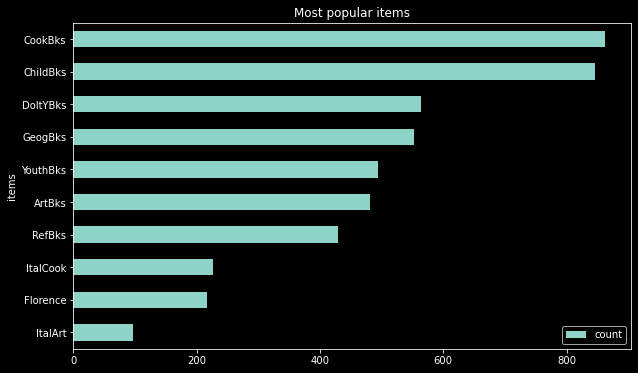

# 📚 Book Recommendation System using Association Rules

## 📌 Project Overview

This project builds a **Book Recommendation System** using **Association Rule Mining (Apriori Algorithm)** to discover hidden relationships between books frequently purchased together.

The system helps bookstores improve:

- Cross-selling
- Product recommendations
- Customer engagement
- Revenue generation

The project also includes:

- Exploratory Data Analysis (EDA)
- Frequent Itemset Mining
- Association Rule Generation
- Flask Web Application
- Database Integration
- Visualization of Support, Confidence, and Lift

---

# 🎯 Business Problem

A famous bookstore was experiencing declining growth because of:

- Online book-selling platforms
- Increased internet accessibility
- Reduced customer footfall

The solution was to create an intelligent recommendation engine using purchasing patterns.

---

# 🧠 Objective

### Business Goal

Increase bookstore sales through smart book recommendations.

### Machine Learning Goal

Use Association Rule Mining to identify books frequently purchased together.

### Economic Goal

Improve overall revenue and customer retention.

---

# 📂 Dataset Description

The dataset contains binary purchase information for different book categories.

### Features

- ChildBks → Children’s Books
- YouthBks → Youth Books
- CookBks → Cooking Books
- DoItYBks → DIY Books
- RefBks → Reference Books
- ArtBks → Art Books
- GeogBks → Geography Books
- ItalCook → Italian Cooking Books
- ItalAtlas → Italian Atlas Books
- ItalArt → Italian Art Books
- Florence → Florence Travel Books

Each value:
- `1` → Customer purchased the category
- `0` → Customer did not purchase the category

---

# 🛠️ Technologies Used

- Python
- Pandas
- Matplotlib
- MLxtend
- Flask
- SQLAlchemy
- MySQL
- HTML/CSS

---

# 🔍 Association Rule Mining

The project uses the **Apriori Algorithm** to identify:

- Frequent itemsets
- Purchase combinations
- Recommendation rules

### Metrics Used

- Support
- Confidence
- Lift

---

# 📊 Data Visualization

## 1️⃣ Association Rule Scatter Plot

This graph visualizes:

- Confidence
- Support
- Lift



### 🔍 Insights

- Some book combinations have very high confidence (>90%).
- High lift values indicate strong relationships between book categories.
- Certain books are highly likely to be purchased together.
- The recommendation engine can use these patterns for personalized suggestions.

---

# 🌐 Web Application Interface

The recommendation system was deployed using **Flask**.


### Features

- Upload dataset file
- Enter database credentials
- Generate association rules automatically
- Store results in MySQL database
- Display recommendations dynamically

---

# ⚙️ Machine Learning Workflow

## Step 1: Data Collection

- Loaded bookstore transaction dataset.

## Step 2: Database Integration

- Connected dataset with MySQL using SQLAlchemy.

## Step 3: Data Preprocessing

- Checked missing values
- Prepared binary transactional dataset

## Step 4: Frequent Itemset Mining

Applied:
- Apriori Algorithm

## Step 5: Association Rule Generation

Generated rules using:
- Support
- Confidence
- Lift

## Step 6: Duplicate Rule Removal

- Removed redundant association rules.

## Step 7: Visualization

- Scatter plot for rule evaluation.

## Step 8: Deployment

- Built Flask web application.
- Connected frontend with backend recommendation engine.

---

# 📈 Key Insights

- Cooking books frequently appear with DIY and Art books.
- Certain book categories strongly influence additional purchases.
- High-confidence rules improve recommendation accuracy.
- Association Rules can significantly improve bookstore sales strategies.

---

# 🚀 Future Improvements

- Add collaborative filtering.
- Deploy recommendation API.
- Build personalized recommendation dashboard.
- Add real-time recommendation engine.
- Integrate user purchase history.

---

# 📁 Repository Structure

```bash
Book-Recommendation-System-Association-Rules/
│
├── IMAGES/
│   ├── image.png
│   └── index png.png
│
├── templates/
│   └── index.html
│
├── association_rules.py
├── app.py
├── Book-Recommendation-System-Association-Rules.ipynb
├── book.csv
└── README.md
```

---

# 📏 Evaluation Metrics

## Support

Measures how frequently a book combination appears in transactions.

## Confidence

Measures how likely a customer buys Book B after purchasing Book A.

## Lift

Measures the strength of the recommendation rule.

- Lift > 1 → Strong relationship
- Lift = 1 → No relationship
- Lift < 1 → Negative relationship

---

# 🎯 Conclusion

This project demonstrates how **Association Rule Mining** can be used to build an intelligent recommendation engine for bookstores.

The project successfully showcases:

- Frequent itemset mining
- Recommendation system development
- Association Rule Analysis
- Flask deployment
- Database integration
- Business-focused machine learning

It provides a practical real-world implementation of recommendation systems used in:

- Amazon
- Netflix
- E-commerce platforms
- Online bookstores

---

# 👨‍💻 Author

**Lucky Singh**  
Aspiring Data Scientist | Machine Learning Enthusiast
